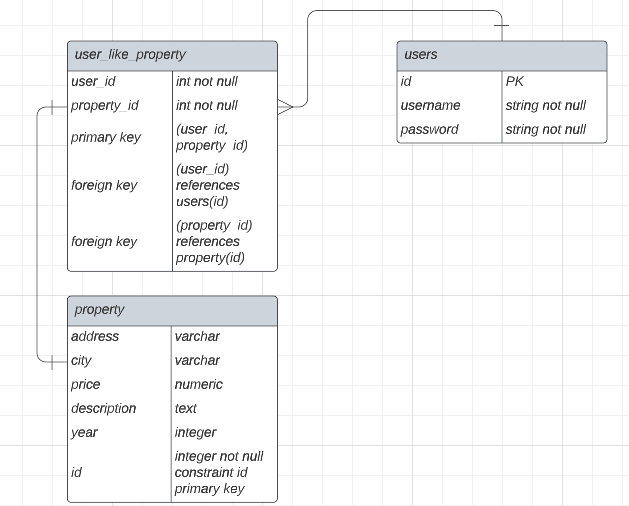

# Prueba técnica - Imagine Apps

Este repositorio contiene mi solución a la prueba técnica de Imagine Apps.

## Tecnologías utilizadas

- Node.js
- Express
- Sequelize
- PostgreSQL

## Configuración del proyecto

### Instalación de dependencias

Para instalar las dependencias del proyecto, se debe ejecutar el siguiente comando:

Vaya a la carpeta backend:
`cd backend`:

Instale las dependencias

`npm install`

### Configuración de la base de datos

La aplicación utiliza una base de datos PostgreSQL. Para configurar la conexión a la base de datos, se deben establecer las variables de entorno `user`, `pass`, `host`, y `schema` con los valores correspondientes.

<!-- Además, se debe ejecutar el siguiente comando para crear las tablas necesarias en la base de datos:

Copy code

`npx sequelize-cli db:migrate` -->

### Ejecución de la aplicación

Para ejecutar la aplicación, se debe ejecutar el siguiente comando:

`npm run dev`

## Endpoints

A continuación se describen los endpoints disponibles en la aplicación.

### GET /api/properties

Devuelve una lista de todas las propiedades registradas en la base de datos.

Tambien se puede filtrar por req.query o req.body: `address`, `city`, `price`, `year`

<!-- ### POST /properties/:id/like

Registra que un usuario ha dado "like" a una propiedad específica. Se debe especificar el `id` de la propiedad en la URL. -->

## Diseño de la base de datos

La tabla `property` contiene información sobre cada propiedad, como su dirección, ciudad, precio, descripción y año de construcción.

La tabla `status` contiene información sobre los diferentes estados que puede tener una propiedad, como "en venta", "vendida" o "pre venta".

La tabla `status_history` es una tabla intermedia que relaciona las propiedades con sus estados. Cada registro en esta tabla representa un cambio de estado en una propiedad en una fecha determinada.

<!-- La tabla `likes` registra los "likes" que han dado los usuarios a las propiedades. Cada registro en esta tabla representa un "like" de un usuario a una propiedad en una fecha determinada. -->

## "LIKE" SERVICE

Este proyecto extiende el modelo de la base de datos existente para permitir que los usuarios den "like" a propiedades. Para lograrlo, se ha creado una nueva entidad llamada `user_like_property` que registra la información de los likes de los usuarios.

Adjunto el diagrama E-R que diseñé para la base de datos, en el archivo "er-diagram.png":


##### Diagrama entidad-relación

El siguiente diagrama entidad-relación muestra la nueva entidad `user_like_property` y sus relaciones con las entidades existentes `User` y `Property`:

##### Diagrama entidad-relación

Código SQL
El siguiente código SQL crea la tabla `user_like_property` y define sus relaciones con las tablas existentes `user` y `property`:

```sql
CREATE TABLE user_like_property (
    user_id INT NOT NULL,
    property_id INT NOT NULL,
    PRIMARY KEY (user_id, property_id),
    FOREIGN KEY (user_id) REFERENCES users(id),
    FOREIGN KEY (property_id) REFERENCES property(id)
);
```

La tabla `user_like_property` tiene dos columnas: `user_id` y `property_id`, que almacenan la información del usuario que dio like y la propiedad que recibió el like, respectivamente. La clave primaria de la tabla se define como una combinación de ambas columnas para garantizar que un usuario solo pueda dar like a una propiedad una vez.

La tabla `user_like_property` también tiene dos relaciones belongsTo con las tablas existentes `user` y `property`. La primera relación define que la columna `user_id` de la tabla `user_like_property` se relaciona con la columna id de la tabla `user`. La segunda relación define que la columna `property_id` de la tabla `user_like_property` se relaciona con la columna `id` de la tabla `property`.

Explicación
Se ha creado la tabla `user_like_property` y se han definido sus relaciones con las tablas existentes `user` y `property` para permitir que los usuarios den "like" a propiedades. Al agregar esta nueva entidad y sus relaciones, se puede registrar qué usuario dio like a qué propiedad y realizar consultas para obtener esta información.

Además, al definir las relaciones belongsTo con las tablas existentes, se garantiza que los datos se mantengan integrales y coherentes en todo momento.

Para más información acerca de este proyecto, por favor consultar la documentación.

## Comentarios adicionales

¡Gracias por la oportunidad de dejarme participar en esta prueba técnica!
